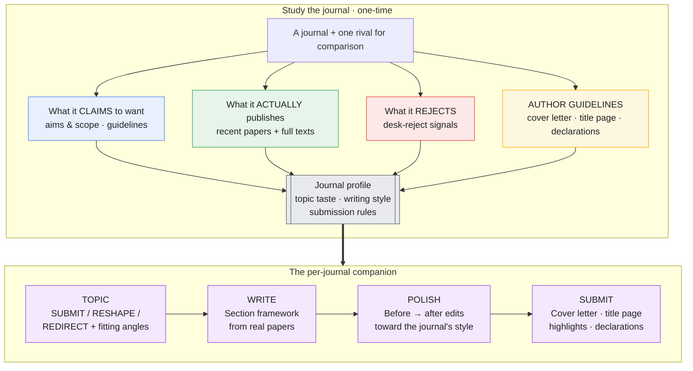

<div align="center">

# Journal Compass

**A Claude skill that learns a journal and guides your manuscript from idea to submission.**

[English](README.md) · [中文](README_zh.md)

</div>

---

Most journals have clear preferences that aren't written down anywhere. You can see them in what gets published, what gets desk-rejected, and in the gap between a journal's stated aims and its actual output. Journal Compass reads all of that — including open-access full texts when it can — and packages what it learns into a per-journal skill that sticks with your manuscript through four steps.

---

## How it works



Distill a journal once; reuse the companion for every paper you send there.

---

## What it learns

| | What | Where it comes from |
|---|---|---|
| 1 | Topic taste and direction | Recent papers — what's being published, what's saturated, what gaps exist |
| 2 | Writing style and section framework | Open-access full texts when available; otherwise abstracts |
| 3 | Author guidelines | The official Guide for Authors: word limits, abstract format, cover letter expectations, title-page requirements, mandatory declarations |
| 4 | Rejection signals | Reviewer guidelines, desk-reject criteria, author reports |
| 5 | What sets it apart from similar journals | A comparison against one rival journal |

---

## Four steps

**TOPIC** — Give it an idea or abstract. It returns a verdict:
- **SUBMIT** — fits as-is or close to it
- **RESHAPE** — right journal, wrong angle — here's the specific fix
- **REDIRECT** — won't work even reshaped, with a suggestion of where to send it instead

It also proposes 2–3 topic angles that match what this journal is currently looking for.

**WRITE** — It gives you the journal's section structure: how the introduction moves, where research questions go, how methods are organized, how results are reported, what a discussion covers and in what order. Each element is anchored to a real published paper.

**POLISH** — Paste a paragraph or a full draft. It returns before → after edits targeting the journal's style, enforces the word and abstract limits, and clears each desk-reject red flag.

**SUBMIT** — It drafts a cover letter in the beats this journal expects, lists the exact title-page elements (with a strip-list for double-blind submissions), assembles highlights, and generates a declarations checklist so nothing gets missed at the desk.

---

## A quick example — *Computers & Education*

The repo includes a fully sourced distillation: [`examples/computers-education-fit/`](examples/computers-education-fit/).

**TOPIC check:**
> *"We built a ChatGPT plugin and surveyed 40 students. 85% said it was helpful and easy to use."*

> **REDIRECT / borderline RESHAPE.** Two desk-reject flags: this is a single-class satisfaction study with no measured learning outcome and no generalizability beyond one classroom. To make it work for C&E: replace the satisfaction survey with a design that measures a learning construct (e.g. self-regulation gains vs a control) and argue why the findings extend beyond this setting. As written, it fits a technology-acceptance venue better than C&E.

**WRITE:**
> Title pattern: *[Construct] + [method signal]* → "The effect of GPT scaffolding on self-regulated learning: A quasi-experimental study"
> Abstract (≤250 words): why self-regulation matters in online learning → the gap → what you did → one-line method → key finding with effect size → what it means for teaching

**POLISH:**
> Before: "Students really liked the tool and found it easy to use."
> After: "Students in the scaffold condition scored higher on self-regulated learning than the control group (*d* = 0.42), suggesting the tool supports metacognitive monitoring."

**SUBMIT:**
> Cover letter opening: "We submit 'The effect of GPT scaffolding on self-regulated learning' for consideration in *Computers & Education*. In a 12-week quasi-experiment (N = 210), the scaffold improved self-regulated learning outcomes relative to a matched control — addressing a question relevant to the wider education community: how generative AI can support rather than replace student regulation…"

Every claim in the companion traces back to sourced evidence files: what C&E says, publishes, and rejects; its guidelines; its section structure (from three open-access full texts); and how it differs from BJET.

---

## One rule that keeps it useful

Most "journal writing tips" apply to an entire field. Journal Compass only keeps a finding if it would change which of two similar journals you'd submit to. That's why you give it a rival journal to compare against — it's how field-wide norms get filtered out, leaving only what's actually specific to this journal.

It's also built to be accurate rather than confident: it doesn't invent acceptance rates, doesn't dress up general norms as a journal's private taste, and always notes the gap between what a journal claims and what it actually publishes. The submission kit is a draft to check against the live Guide for Authors, not a replacement for reading it.

---

## Install

```bash
git clone https://github.com/Youn-17/journal-compass.git

# available across all projects
cp -R journal-compass ~/.claude/skills/journal-compass

# or just for one project
mkdir -p .claude/skills
cp -R journal-compass .claude/skills/journal-compass
```

Restart Claude Code. Required files: `SKILL.md` and `references/`. To use the included C&E companion, also copy `examples/computers-education-fit` into your skills folder.

## Usage

```
Distill Computers & Education
Where should I submit a study on GenAI and learning analytics?

# once distilled:
Is this abstract a fit for Computers & Education?  [paste]
Give me the C&E section framework for this study
Write my cover letter and title page for C&E
```

## Repo layout

```
journal-compass/
├── SKILL.md                      # the distiller
├── references/
│   ├── signal-mining.md          # how to separate real findings from field-wide noise
│   └── fit-skill-template.md     # skeleton for each <journal>-fit companion
└── examples/
    └── computers-education-fit/
        ├── SKILL.md
        └── references/evidence/  # claims · published · rejected · guidelines · writing-framework · rival-bjet
```

## Contributing

PRs welcome, especially new distilled journals under `examples/`. Every distillation should be grounded in real, sourced evidence — each claim with a URL and a confidence tag.

## License

Created by **Adrian** ([@Youn-17](https://github.com/Youn-17)) · [MIT](LICENSE) © 2026 Adrian · Made with [Claude Code](https://claude.com/claude-code)
