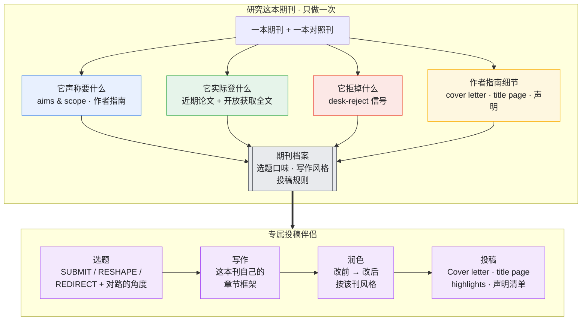

<div align="center">

# Journal Compass

**一个 Claude 技能，读懂一本期刊，陪你从选题走到投稿。**

[English](README.md) · [中文](README_zh.md)

</div>

---

大多数期刊的偏好没有明说。你只能从它发了什么、拒了什么、以及官方声明和实际刊登内容之间的落差里，慢慢推断。Journal Compass 把这些都读一遍——有开放获取全文的时候连正文一起读——然后把结论打包成一个专属技能，全程陪你写稿和投稿。

---

## 工作方式



蒸馏一次，反复用。档案建好后，每次投这本刊都能直接调用。

---

## 它学什么

| | 维度 | 来源 |
|---|---|---|
| 1 | 选题口味和方向 | 近期论文——登什么、什么饱和、哪里有缺口 |
| 2 | 写作风格和章节框架 | 开放获取全文（有的话）；否则从摘要推断 |
| 3 | 作者指南 | 官方 Guide for Authors：字数、摘要格式、cover letter 要点、title page 要素、强制声明 |
| 4 | 拒稿信号 | 审稿指南、desk-reject 标准、作者社区报告 |
| 5 | 与同类期刊的区别 | 与一本对照刊的比较 |

---

## 四步

**选题** — 把一个 idea 或摘要发给它，它给出判断：
- **SUBMIT** — 可以投，或接近可以投
- **RESHAPE** — 方向对，角度错——具体改什么
- **REDIRECT** — 改也没用，建议改投哪里

同时给 2–3 个符合这本刊当前口味的角度。

**写作** — 给你这本刊的章节结构：引言怎么推进、研究问题放在哪、方法怎么分节、结果怎么报告、讨论按什么顺序写。每一条都对应一篇真实发表的论文。

**润色** — 贴一段或整篇草稿，返回"改前 → 改后"的具体修改，对准该刊风格，同时卡住字数和摘要上限，扫掉每一处 desk-reject 雷区。

**投稿** — 按这本刊的要求起草 cover letter，列出 title page 的确切要素（双盲投稿时另附需要从正文删掉的清单），整理好 highlights，并生成声明清单，确保没有遗漏。

---

## 一个实际例子 — *Computers & Education*

仓库里附了一份完整蒸馏成果：[`examples/computers-education-fit/`](examples/computers-education-fit/)。

**选题判断：**
> *"我做了个 ChatGPT 插件，在自己班上调查了 40 个学生，85% 说有帮助、好用。"*

> **REDIRECT，勉强可 RESHAPE。** 两个 desk-reject 问题：这是单班满意度调查，没有可测的学习结果，也没有超出这间教室的意义。要投 C&E，需要把满意度问卷换成能测学习构念的设计（比如和对照组比较自我调节学习的提升），并说清楚为什么结论可以推广。照现在的样子，更适合投技术接受度类的期刊。

**写作框架：**
> 标题套路：*[构念] + [设计信号]* → "The effect of GPT scaffolding on self-regulated learning: A quasi-experimental study"
> 摘要（≤250 词）：在线学习中自我调节为何重要 → 缺口 → 做了什么 → 方法一句话 → 关键结果带效应量 → 对教学的意义

**润色：**
> 改前："学生很喜欢这个工具，觉得很好用。"
> 改后："使用 GPT 支架的学生在自我调节学习上的得分高于对照组（d = 0.42），表明该支架支持了元认知监控。"

**投稿材料：**
> Cover letter 开头："We submit 'The effect of GPT scaffolding on self-regulated learning' for consideration in *Computers & Education*. In a 12-week quasi-experiment (N = 210), the scaffold improved self-regulated learning relative to a matched control — relevant to how generative AI can support rather than replace student regulation…"

上面每一条结论，都能在 [`examples/computers-education-fit/references/evidence/`](examples/computers-education-fit/references/evidence/) 里找到出处：C&E 声称什么、实际登什么、拒什么、它的作者指南、章节结构（来自三篇开放获取全文），以及它与 BJET 的区别。

---

## 有效的关键：对照刊

大多数"投稿建议"对整个领域都成立。Journal Compass 只保留一种发现：知道它，会改变你在两本相似期刊之间的投稿选择。所以必须给它一本对照刊——这是过滤全领域通用规范、只留这本刊特有口味的方法。

它不编造录用率和指南细节，不把全领域常识包装成某本刊的独有特色，永远指出声称和实际之间的落差。生成的投稿材料是草稿，投稿前仍需核对期刊最新的作者指南。

---

## 安装

```bash
git clone https://github.com/Youn-17/journal-compass.git

# 用户级（所有项目可用）
cp -R journal-compass ~/.claude/skills/journal-compass

# 或项目级
mkdir -p .claude/skills
cp -R journal-compass .claude/skills/journal-compass
```

重启 Claude Code。必须的文件是 `SKILL.md` 和 `references/`。要直接用附带的 C&E 伴侣，把 `examples/computers-education-fit` 也复制进 skills 目录。

## 用法

```
Distill Computers & Education
我做 GenAI + 学习分析，投哪本刊？

# 蒸馏完成后：
这段摘要适合投 Computers & Education 吗：[贴摘要]
按 C&E 框架帮我写引言
帮我写投 C&E 的 cover letter 和 title page
```

## 仓库结构

```
journal-compass/
├── SKILL.md                      # 蒸馏器
├── references/
│   ├── signal-mining.md          # 如何过滤全领域通用规范，找出真正有效的信号
│   └── fit-skill-template.md     # 每个 <journal>-fit 伴侣的骨架
└── examples/
    └── computers-education-fit/
        ├── SKILL.md
        └── references/evidence/  # claims · published · rejected · guidelines · writing-framework · rival-bjet
```

## 贡献

欢迎 PR，尤其是 `examples/` 下新增的期刊蒸馏成果。每一条结论都需要真实来源——附上 URL 和可信度标签。

## 许可证

Created by **Adrian** ([@Youn-17](https://github.com/Youn-17)) · [MIT](LICENSE) © 2026 Adrian · Made with [Claude Code](https://claude.com/claude-code)
